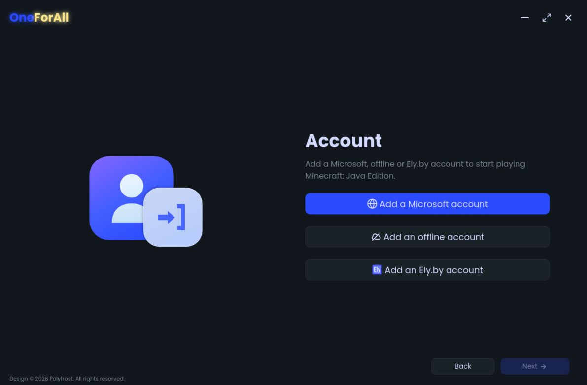
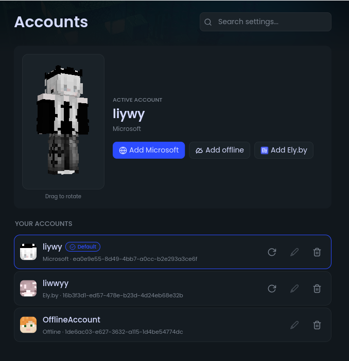
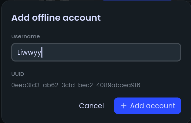
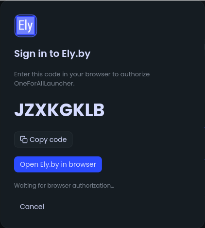
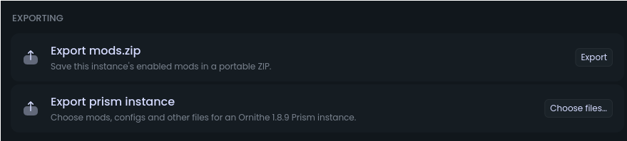
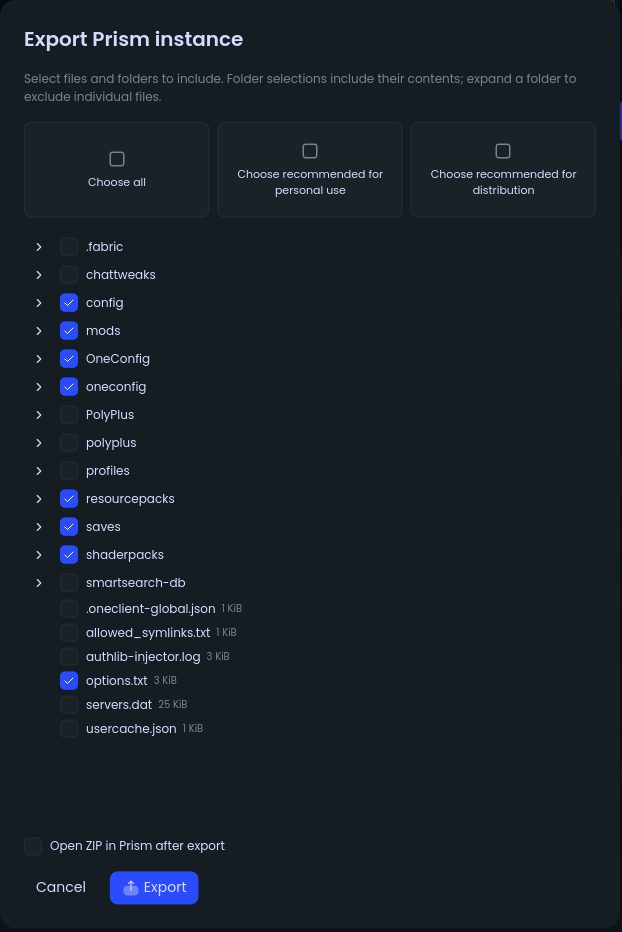

<div align="center">


<h1>
<a style="color:#f5c2e7" href="https://github.com/liwwyy/OneForAllLauncher">OneForAll Launcher</a>
</h1>

A OneLauncher/OneClient fork that **removes offline account restrictions**, adds Ely.by authentication, and provides instance/mods exporting

This fork is **not** endorsed by Polyfrost/OneLauncher

<div>

[](https://github.com/liwwyy/OneForAllLauncher/stargazers)

</div>

</div>

## Screenshots

<details>
  <summary>Show</summary>

  <div align="center">
    <div style="display: grid; grid-template-columns: repeat(3, 1fr); gap: 10px;">
      
      
      
      
      
      
    </div>
  </div>

</details>

## Warning

> [!WARNING]
> This is a fork modified and maintained with **AI**.

## Features

- Add offline accounts without first signing in with a Microsoft account.
- Sign in with Microsoft or [Ely.by](https://ely.by/). Ely.by skin visibility to other players depends on server support.
- Export enabled mods as a portable ZIP, including manually added mods and linked files from the launcher cache.
- Export **Ornithe Gen2 Minecraft 1.8.9** instances for Prism Launcher, with a file/folder picker, personal-use and distribution presets, remembered selections, and optional opening in Prism.
- Follow exports through live progress notifications with file names and completion details.
- Install alongside upstream OneClient using separate accounts, settings and game data.
- Based on upstream OneLauncher, with the fork-specific changes described here.
- Free and open-source under GPL-3.0-only.

### Offline account limitations

Offline accounts can be used for singleplayer and servers configured to accept offline players. Servers requiring Microsoft/Mojang authentication still need an account with Minecraft access. Initial game, loader and mod downloads require an internet connection.

> [!IMPORTANT]
> **PolyPlus world hosting, social and cosmetic features do not work with offline accounts.** The launcher's current PolyPlus integration requires an authenticated Microsoft Minecraft account; Ely.by sign-in also does not enable these services.

## Installation

### Stable Releases

Download OneForAll Launcher from [GitHub Releases](https://github.com/liwwyy/OneForAllLauncher/releases/latest). Choose the package for your operating system and processor:

| Platform | Download | Installation |
| --- | --- | --- |
| Windows x86_64 | `.exe` | Run the installer. |
| Linux x86_64 | `.AppImage` | Mark the file executable, then run it. |
| Debian/Ubuntu x86_64 | `.deb` | Install with your distribution's package installer. |
| Fedora/openSUSE x86_64 | `.rpm` | Install with your distribution's package manager. |
| macOS Apple Silicon | `darwin_aarch64.dmg` | Open the DMG and copy the app to Applications. |
| macOS Intel | `darwin_x86_64.dmg` | Open the DMG and copy the app to Applications. |

macOS also has `.app.tar.gz` archives for each processor type. Releases include `SHA256SUMS.txt` for checking downloads. Current builds are unsigned, and macOS builds are not notarized, so Windows SmartScreen or macOS Gatekeeper may show a warning or block them.

> [!NOTE]
> Automatic launcher updates are **not supported for now**. Download and install newer versions manually from [GitHub Releases](https://github.com/liwwyy/OneForAllLauncher/releases/latest). Publishing a new release does not update existing installations automatically.

## Community & Support

If you found a bug or want to suggest a feature, please open an issue in [GitHub Issues](https://github.com/liwwyy/OneForAllLauncher/issues). Pull requests and contributions (code, docs, translations) are welcome!

### Discord

<a href="https://discord.com/users/1476376719668674620"></a>

## Building from Source

OneForAllLauncher is a Rust workspace using Freya/Skia. Install **Rust 1.97 or newer** with [rustup](https://rustup.rs/), plus Git and the native build dependencies for your platform.

### Prerequisites

- **Windows:** use the MSVC Rust toolchain and install Visual Studio Build Tools with **Desktop development with C++** and a Windows SDK, plus CMake and Python 3.
- **macOS:** install Xcode command-line tools with `xcode-select --install`. Install CMake, pkg-config and Python 3; with Homebrew, use `brew install cmake pkg-config python`.
- **Linux:** install a C/C++ toolchain, CMake, Clang, pkg-config, Python 3, and the font, windowing, graphics, GTK and D-Bus development libraries below.

On **Ubuntu 22.04**, these match the release workflow's build dependencies:

```sh
sudo apt-get update
sudo apt-get install -y --no-install-recommends \
  build-essential cmake pkg-config clang python3 \
  libfontconfig-dev libfreetype-dev \
  libgl1-mesa-dev libx11-dev libxcursor-dev libxi-dev libxrandr-dev \
  libxkbcommon-dev libxkbcommon-x11-dev libwayland-dev libdbus-1-dev \
  libgtk-3-dev libayatana-appindicator3-dev
```

Other Linux distributions use different package names. AppImage packaging/running may also need FUSE support; the Ubuntu 22.04 release runner installs `libfuse2`.

### Build and run

```sh
git clone https://github.com/liwwyy/OneForAllLauncher.git
cd OneForAllLauncher
rustup toolchain install stable --profile minimal
rustc +stable --version

cargo +stable build --locked -p oneclient_app --bin oneforall_app -j 2
cargo +stable run --locked -p oneclient_app --bin oneforall_app
```

Check that the Rust version is at least 1.97. Run Cargo commands from the repository root. The executable is `target/debug/oneforall_app` on Linux/macOS, or `target/debug/oneforall_app.exe` on Windows. Internal workspace package names still use the `oneclient_` prefix.

Debug builds use the separate **OneForAllLauncher-dev** data directory. Release builds use **OneForAllLauncher**, so their accounts and settings are separate. Neither uses upstream OneClient's data directory.

For an optimized executable:

```sh
cargo +stable build --locked --release -p oneclient_app --bin oneforall_app -j 2
```

The executable is placed under `target/release/`. Builds can take several minutes and substantial RAM/disk space; use `-j 1` for fewer concurrent compiler jobs. The default release profile uses fat LTO; CI uses thin LTO and 16 codegen units to reduce memory use.

### Checks

```sh
cargo +stable test --locked -p oneclient_auth -j 2
cargo +stable test --locked -p oneclient_core -p oneclient_events -p oneclient_app --lib -j 2
```

### Optional packaging

After building the release executable, Linux users can create DEB and AppImage packages:

```sh
cargo +stable install cargo-packager --version 0.11.8 --locked
NO_STRIP=1 cargo +stable packager --release --packages oneclient_app --formats deb,appimage
```

Output is under `target/release/`. `NO_STRIP=1` avoids linuxdeploy's older strip tool failing on modern system libraries; Cargo already strips the release executable.

See [the release workflow](.github/workflows/oneclient_release.yml) for Windows NSIS runtime bundling, macOS app/DMG packages, and Linux RPM packaging. Converted icons, Prism template files and the Ely.by compatibility JAR are included in the repository; the ignored original artwork and example ZIP are not needed. A JDK is only needed when rebuilding the [Java compatibility agent](distribution/elyby-preview-compat/README.md).

## Privacy & Network Requests

The launcher contacts third-party services for sign-in, game metadata, downloads, skins and enabled online features. These include Microsoft/Mojang, Ely.by when you use an Ely.by account, Polyfrost services, and mod/content providers. Those services receive the requests needed to provide their features; an offline account does not make all launcher activity offline.

- **Crash reporting:** controlled by **Settings → Launcher → Crash Reporting** and applies after restarting. Reports require reporting to be enabled and the build to have a configured Sentry endpoint. Declining the terms/privacy consent disables reporting. Fork builds have no Sentry endpoint by default; it must be supplied at build time through `ONEFORALL_SENTRY_DSN`.
- **Discord Rich Presence:** enabled by default and controlled by **Settings → Launcher → Discord RPC**. When enabled, it shares launcher/game activity with your running Discord client.
- **PolyPlus:** when used with a supported Microsoft account, its online services connect to Polyfrost's backend. They are unavailable with offline accounts.

You can inspect the source and these settings before running the launcher. See [Polyfrost's privacy policy](https://polyfrost.org/legal/privacy) for its services; Microsoft, Ely.by and other providers have their own policies.

## About this fork

OneForAll Launcher is independently maintained and is **not endorsed by Polyfrost or the OneLauncher team**. Contributions and bug reports are welcome through this repository's issues and pull requests.

## License

**OneForAllLauncher, a fork of OneClient by Polyfrost.** This project is licensed under the **GNU General Public License, version 3 only (GPL-3.0-only)**. See [LICENSE](LICENSE) for the license terms and [ATTRIBUTION.md](ATTRIBUTION.md) for original credits and third-party notices.

[](https://github.com/liwwyy/OneForAllLauncher/blob/main/LICENSE)
